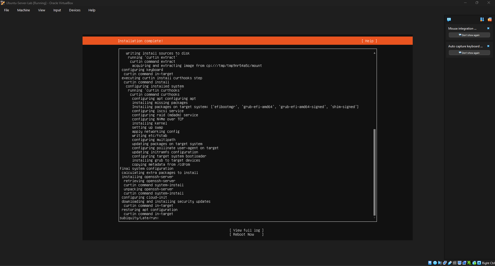
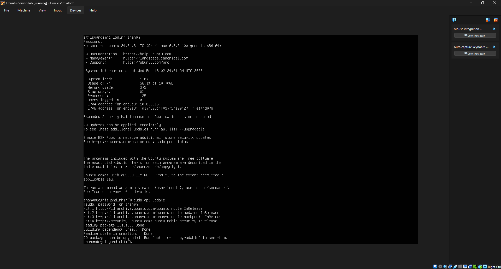
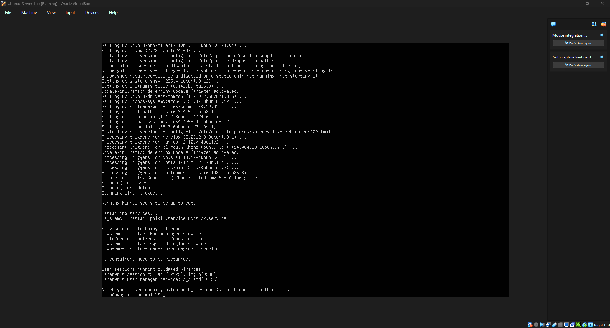
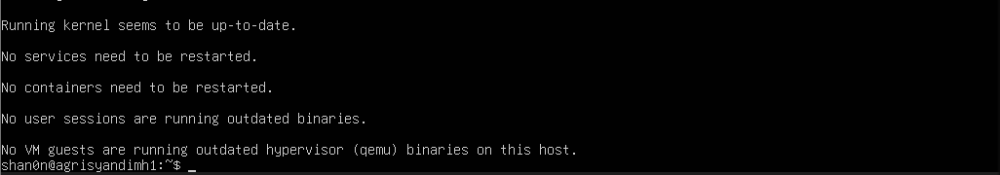
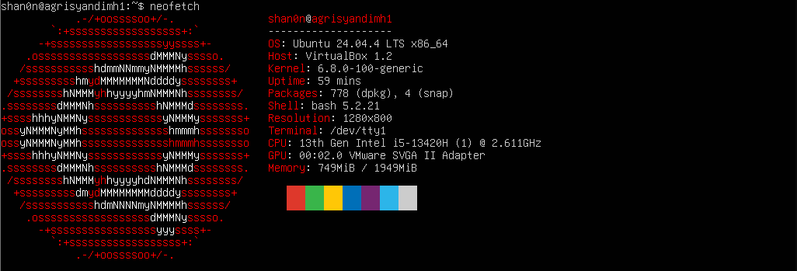
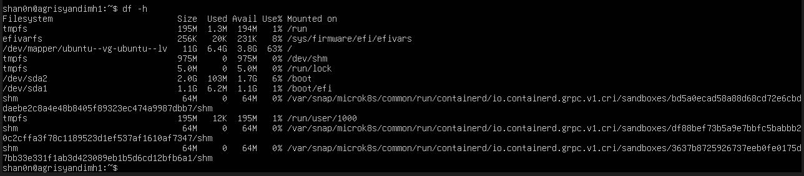
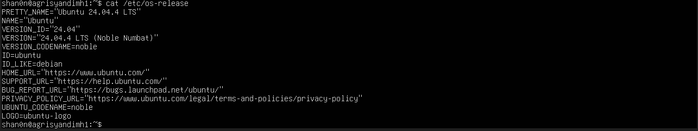
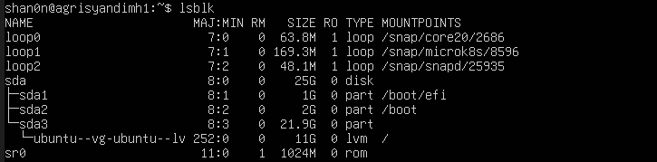
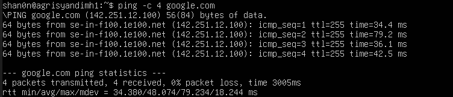
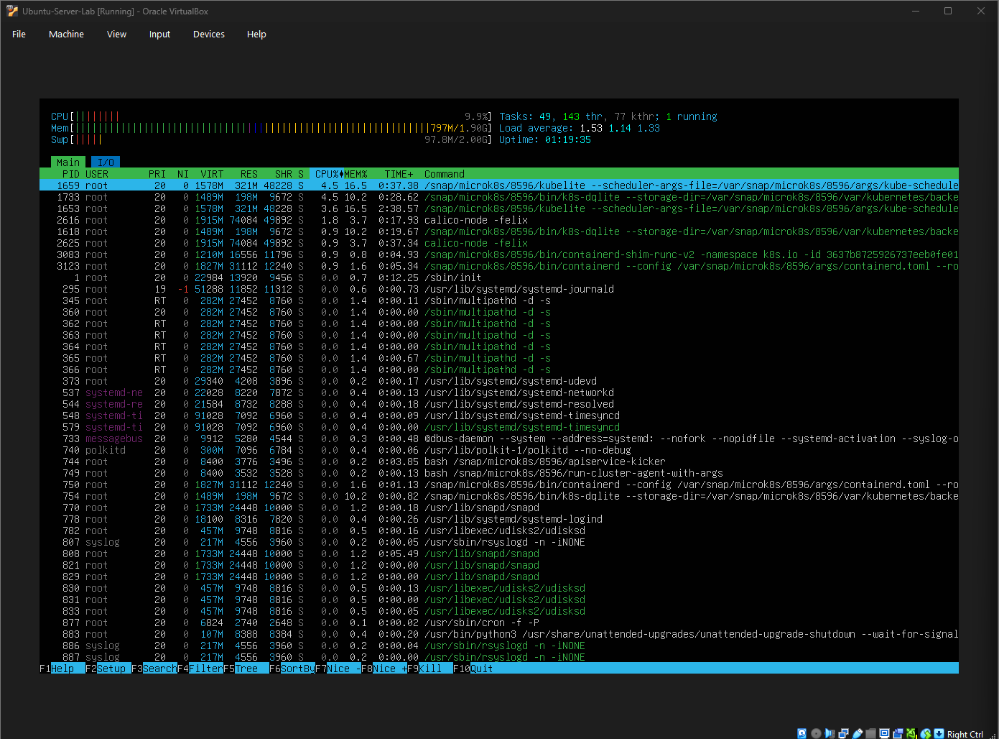

# Jobsheet 1
<<<<<<< HEAD

## Latihan 

### Latihan Konseptual

#### Latihan 1.1
Jelaskan 5 fungsi utama sistem operasi dengan contoh konkret dari minimal 2
OS berbeda (Windows, macOS, atau Linux).

#### Jawaban Latihan 1.1

#### Latihan 1.2
Kapan sebaiknya menggunakan Windows vs Linux vs macOS? Analisis
berdasarkan use case: gaming, development, server, creative work, dan enterprise.

#### Jawaban Latihan 1.2
=======
## Latihan Konseptual
### Latihan 1.1
Jelaskan 5 fungsi utama sistem operasi dengan contoh konkret dari minimal 2
OS berbeda (Windows, macOS, atau Linux).

Manajemen proses, Manajemen memori, Manajemen sistem berkas, Manajemen device, Manajemen dan hak akses

### Latihan 1.2
Kapan sebaiknya menggunakan Windows vs Linux vs macOS? Analisis
berdasarkan use case: gaming, development, server, creative work, dan enterprise.

- gaming: Windows lebih rasional
- development: relatif, tergantung bidangnya. Misalnya Linux dipakai untuk backend atau mac untuk iOS/mac development itu sendiri
- server: Linux lebih dominan
- creative work: dominan di mac dan Windows
- enterprise: lebih unggul Windows

## Latihan Praktikal
### Latihan 1.3
Install Ubuntu Server 22.04 LTS di VirtualBox menggunakan langkah-langkah berikut:
1. Download Ubuntu Server ISO dari website resmi
2. Create VM baru di VirtualBox (RAM: 2GB, Disk: 25GB)
3. Install dengan automatic partitioning (guided)
4. Buat user account dengan password yang kuat
5. Reboot dan login ke sistem
6. Dokumentasikan proses instalasi dengan screenshot key steps

### Latihan 1.4
Setelah instalasi Ubuntu Server, lakukan tasks berikut:
1. Update package list: sudo apt update

2. Upgrade packages: sudo apt upgrade

3. Install neofetch: sudo apt install neofetch

4. Jalankan neofetch dan screenshot hasilnya

5. Check disk usage dengan df -h

6. Check memory dengan free -h

7. Dokumentasikan output dari setiap command

### Latihan 1.5
Eksplorasi sistem yang baru diinstall:
1. Tampilkan informasi OS: cat /etc/os-release

2. Tampilkan versi kernel: uname -r

3. List partisi: lsblk

4. Check network connectivity: ping -c 4 google.com

5. Install dan jalankan htop untuk melihat resource usage

## Latihan Refleksi
### Latihan 1.6

1. Sistem operasi apa yang Anda gunakan sehari-hari? (Windows, macOS,
Linux, atau lainnya)
2. Berapa lama Anda menggunakan sistem operasi tersebut?
3. Apa yang Anda sukai dari sistem operasi tersebut?
4. Apa tantangan atau masalah yang pernah Anda hadapi?
pengalaman Anda.
5. Apakah Anda pernah menggunakan sistem operasi lain? Bandingkan
6. Setelah mempelajari bab ini, apakah ada sistem operasi lain yang ingin
Anda coba? Mengapa?

Sejak dulu saya selalu menggunakan sistem operasi Windows, saya selalu menggunakannya di perangkat manapun yang saya gunakan entah itu di laptop atau pun di PC. Biasanya, saya akan menggunakan OS ini saat saya diberikan tugas dari sekolah pada perangkat kantoran yang sederhana. Saya sudah menggunakan OS ini mungkin kurang lebih 10 tahun-an. Saya suka kemudahan saat menggunakan OS ini, seperti lebh simpel juga mungkin pembatasan yang diberikan tidak seketat itu, dimana ini sangat mempermudah akses terhadap informasi atau membuat suatu mod dari sebuah aplikasi yang ada. Seperti kebanyakan orang, masalahnya adalah untuk lisensinya, dimana lisensi untuk windows itu tergolong cukup mahal menurut saya, entah itu yang masa trial, apalagi yang permanen. Jujur, saya belum pernah menggunakan OS selain Windows, jadi saya kurang tahu mengenai perbandingannya. Saya dulu hanya pernah melihat orang lain menggunakan OS lain, dimana saat itu beliau menggunakan OS Linux, dan pada saat itu saya merasa kalau OS Linux itu cukup ribet dengan catatan, kalau tidak terbiasa menggunakannya. Setelah mempelajari bab ini, saya menyadari bahwa OS bukan halaman utama yang menampilkan visual, melainkan otak utama yang mengelola interaksi antara hardware dan software. Berdasarkan praktik yang saya lakukan menggunakan server Ubuntu, saya tertarik untuk mengeksplorasi Linux lebih lanjut. Alasan saya memilih Linux tidak lain tidak bukan adalah karena saya penasaran, "apakah benar Linux memang seribet itu?", "apakah Linux bisa sefleksibel itu juga?" saya harap saya dapat menemukan jawabannya dalam eksplorasi saya ini.

Ini salah satu dokumentasi saat menggunakan server Ubuntu dengan htop

>>>>>>> ee2e904 (Minggu 1)
