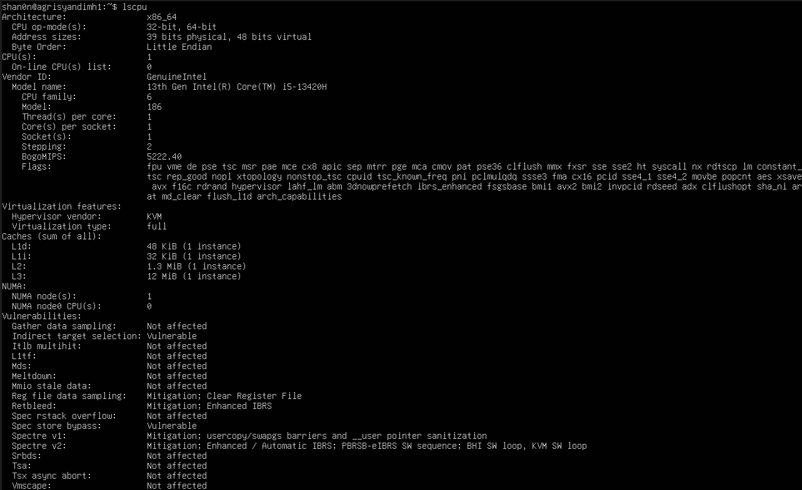
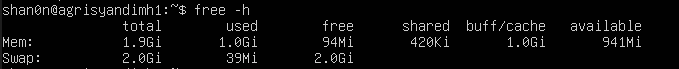
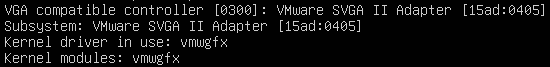
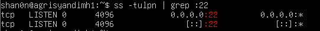
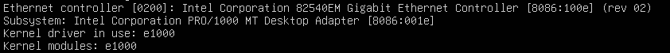
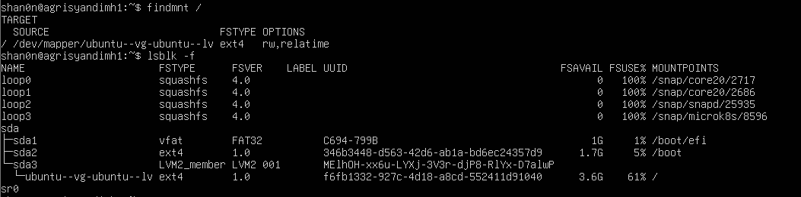
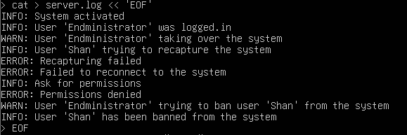
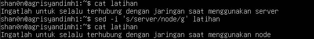
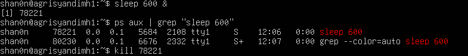
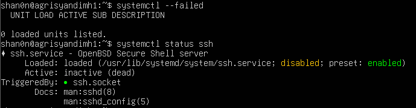

# Jobsheet-2

## Latihan 2.1

1. jumlah CPU(s) core/thread = 1 core, 1 thread
2. total RAM = 1.9 GiB, digunakan 1.0 GiB
3. total swap = 2.0 GiB, digunakan 31 MiB

Jelaskan perbedaan RAM vs swap dalam 2–3 kalimat.
RAM adalah memori fisik utama yang digunakan untuk menyimpan suatu data proses yang sedang berjalan dengan cepat, sedangkan swap 
dalam slot dari disk yang dipakai sebagai cadangan ketika sewaktu-waktu RAM sudah mencapai limit yang ditentukan. Secara kecepat-
-an tentunya RAM asli lebih cepat dibandingkan swap yang merupakan cadangan RAM yang digunakan dari sebuah disk/penyimpanan.

## Latihan 2.2
Temukan 1 perangkat PCI (misal NIC) dan tuliskan: Vendor:Device ID (angka
heksadesimal), nama driver/modul kernel, dan deskripsi singkat fungsinya.

Vendor:Device ID (angka heksadesimal): 8086:100e
Nama Driver/Modul Kernel: Intel 82540EM Gigabit Ethernet Controller/e1000
Deskripsi Singkat Fungsi: sebagai antarmuka jaringan (NIC) untuk menghubungkan komputer ke jaringan kabel

## Latihan 2.3
Dari output ls -l, jelaskan perbedaan penanda file untuk block device dan
character device. (Hint: karakter pertama pada permission string)

Perbedaanya adalah:
- bagian awalnya sebagai penanda, jika b, maka block device, jika c maka, character device
- cara aksesnya, jika block device per blok, sementara jika character device per byte
- contohnya Disk(block device) dan Terminal(character device)

## Latihan 2.4
Gunakan grep untuk menampilkan hanya baris yang mengandung INFO atau
WARN dari data.log. (Hint: gunakan grep -E dengan pola alternatif)

## Latihan 2.5
Pilih satu port yang listening dari output ss -tulpn(misal port 22), lalu
tuliskan service/proses yang membukanya. Jelaskan kegunaan port tersebut
secara singkat.

Port : 22
yang membuka : sshd -> daemon dari OpenSSH
Kegunaan Port: Login remote ke server secara aman, eksekusi perintah jarak jauh, tranfer file yang aman, serta tunneling

# 1.9 Latihan

## Latihan 2.A
Jalankan lspci -nnk. Pilih 1 perangkat PCI dan tuliskan: nama perangkat,
ID vendor:device, dan kernel driver in use.

Nama Perangkat: Intel Corporation 82540EM Gigabit Ethernet Controller.
ID Vendor:Device: 8086:100e.
Kernel Driver in Use: e1000

## Latihan 2.B
Tentukan device root filesystem dengan findmnt /. Lalu cocokkan dengan
lsblk -f dan tuliskan tipe filesystem serta UUID-nya.

Device Root Filesystem: /dev/mapper/ubuntu--vg-ubuntu--lv
Tipe Filesystem: ext4
UUID: f6fb1332-927c-4d18-a8cd-552411d91040

## Latihan 2.C
Buat file server.log berisi minimal 10 baris dengan variasi kata: INFO,
WARN, ERROR. Gunakan grep untuk menampilkan hanya baris ERROR.

## Latihan 2.D
Gunakan sed untuk mengganti semua kata server menjadi node pada file
latihan. Tunjukkan sebelum dan sesudah.

## Latihan 2.E
Gunakan df -h lalu awk untuk menampilkan filesystem yang penggunaan disk
di atas 70%.

ket: pada device saya, tidak ada yang lebih dari 70%

## Latihan 2.F
Jalankan sleep 600 &. Temukan PID-nya dengan ps. Hentikan dengan
SIGTERM. Jelaskan beda SIGTERM vs SIGKILL.

Perbedaan SIGTERM vs SIGKILL
SIGTERM(signal 15) adalah sinyal terminasi yang akan dikirimkan pada suatu proses untuk memintanya untuk berhenti secara normal. Memberikan kesempatan bagi aplikasi untuk melakukan penyimpanan pada data progres pekerjaan, menutup koneksi database, hingga menghapus file sementara sebelum benar benar mati. Kalau SIGKILL adalah sinyal terminasi paksa yang akan langsung mengeksekusi proses dan menghapusnya dari memori langsung tanpa peringatan. Walau efektif untuk dipakai saat terjadi macet, namun berisiko menyebabkan data korup. 

## Latihan 2.G
Gunakan systemctl –failed. Jika tidak ada yang gagal, pilih satu service
aktif (misal ssh) dan tampilkan status serta 30 baris log terakhirnya.

