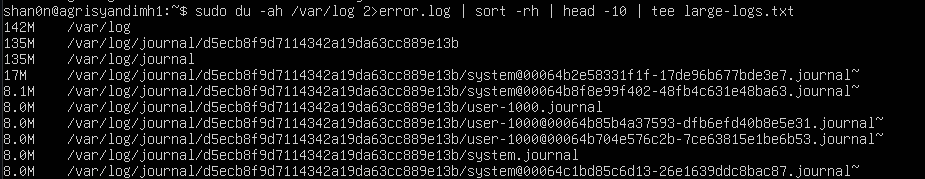
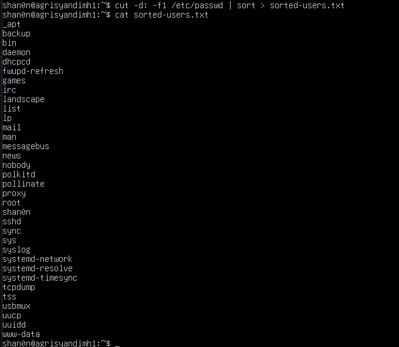
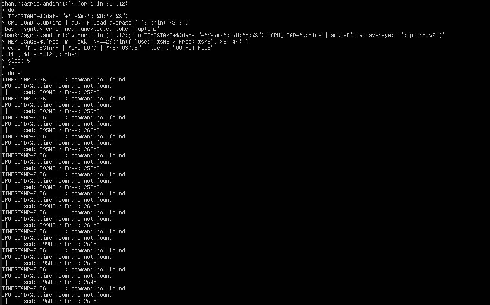

# JOBSHEET-3
## 1.11 Latihan
### Latihan 3.1
Buatlah script yang:
1. Menampilkan daftar 10 file terbesar di direktori /var/log/
2. Menyimpan hasilnya ke file large-logs.txt
3. Menampilkan output juga di terminal menggunakan tee
4. Menangani error dengan redirect ke error.log

### Latihan 3.2
Buat pipeline yang:
1. Membaca /etc/passwd
2. Mengekstrak username (kolom pertama)
3. Mengurutkan alfabetis
4. Menyimpan ke file sorted-users.txt
Hint: Gunakan cut, sort, dan operator redirect.

### Latihan 3.3
Tulis script monitoring yang:
1. Mencatat penggunaan CPU dan memory setiap 5 detik
2. Menyimpan log dengan timestamp
3. Berjalan selama 1 menit (12 iterasi)
4. Output ditampilkan di terminal DAN disimpan ke file

### Latihan 3.4
Buat perintah yang:
1. Mencari semua file .conf di sistem
2. Membuang pesan "Permission denied"
3. Menghitung jumlah file yang ditemukan
4. Menyimpan daftar path lengkap ke file

   
### Latihan 3.5
Implementasikan script backup yang:
1. Menggunakan tar untuk backup direktori
2. Menampilkan progress dengan tee
3. Mencatat stdout ke backup-success.log
4. Mencatat stderr ke backup-error.log
5. Menambahkan timestamp di setiap log entry

