# Jobsheet 4
## Percobaan 1
1. Melihat direktori HOME
   - $ pwd
   - $ echo $HOME
     
   

2. Melihat direktori aktual dan parent direktori
   - $ pwd
   - $ cd .
   - $ pwd
   - $ cd ..
   - $ pwd
   - $ cd
     
   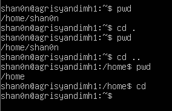

3. Membuat satu direktori, lebih dari satu direktori atau sub direktori
   - $ pwd
   - $ mkdir A B C A/D A/E B/F A/D/A
   - $ ls -l
   - $ ls -l A
   - $ ls -l A/D

     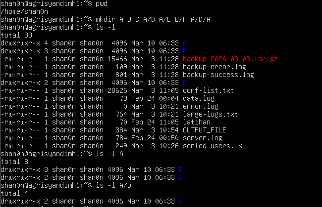

4. Menghapus satu atau lebih direktori hanya dapat dilakukan pada direktori kosong dan hanya dapat dihapus oleh pemiliknya kecuali bila diberikan ijin aksesnya
   - $ rmdir B (Terdapat pesan error, mengapa ?) : error karena direktori B tidak kosong (masih ada sub-direktori F di dalamnya).
   - $ ls -l B
   - $ rmdir B/F B
   - $ ls -l B (Terdapat pesan error, mengapa ?) : yang kedua error karena direktori B sudah berhasil dihapus pada perintah sebelumnya (rmdir B/F B), sehingga sistem tidak menemukannya lagi.

     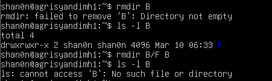

5. Navigasi direktori dengan instruksi cd untuk pindah dari satu direktori ke direktori lain.
   - $ pwd
   - $ ls -l
   - $ cd A
   - $ pwd
   - $ cd ..
   - $ pwd
   - $ cd /home/<user>/C
   - $ pwd
   - $ cd /<user>/C (Terdapat pesan error, mengapa ?): alasan errornya adalah karena jalur/path tersebut dianggap sebagai jalur mutlak dari root (/), disarankan menggunakan /home/<user>/C
   - $ pwd

     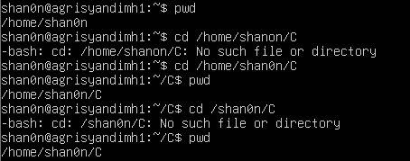

## Percobaan 2: Manipulasi File
1. Perintah cp untuk mengkopi file atau seluruh direktori
   - $ cat > contoh
   - $ cp contoh contoh1
   - $ ls -l
   - $ cp contoh A
   - $ ls -l A
   - $ cp contoh contoh1 A/D
   - $ ls -l A/D

     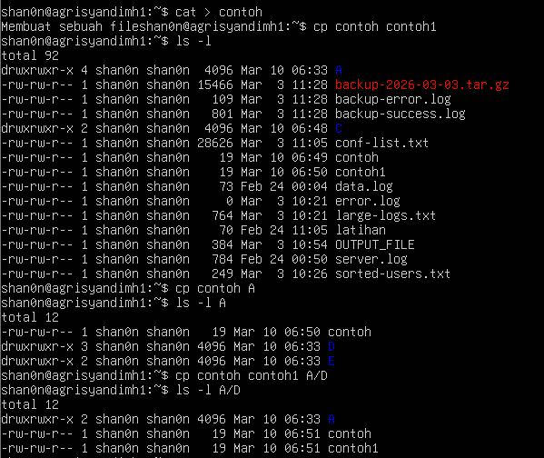

2. Perintah mv untuk memindah file
   - $ mv contoh contoh2
   - $ ls -l
   - $ mv contoh1 contoh2 A/D
   - $ ls -l A/D
   - $ mv contoh contoh1 C

     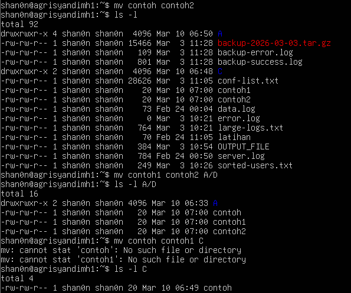

3. Perintah rm untuk menghapus file
   - $ rm contoh2
   - $ ls -l
   - $ rm -i contoh
   - $ rm -rf A C
   - $ ls -l
   
     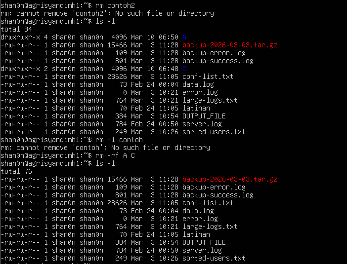

## Percobaan 3: Symbolic Link
Membuat shortcut (file link)
- $ echo "Hallo apa khabar" > halo.txt
- $ ls -l
- $ ln halo.txt z
- $ ls -l
- $ cat z
- $ mkdir mydir
- $ ln z mydir/halo.juga
- $ cat mydir/halo.juga
- $ ln -s z bye.txt
- $ ls -l bye.txt
- $ cat bye.txt

  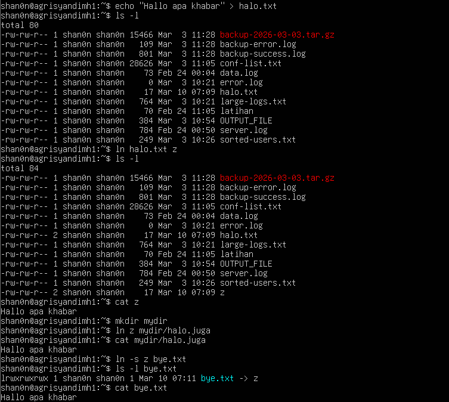

## Percobaan 4: Melihat Isi File
- $ ls -l
- $ file halo.txt
- $ file bye.txt

  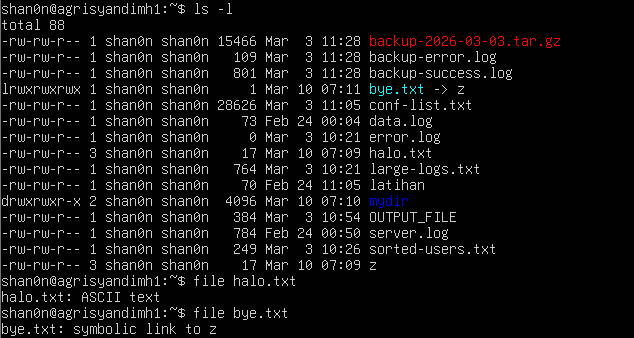

## Percobaan 5: Mencari file
1. Perintah find
   - $ find /home -name "*.txt" -print > myerror.txt
   - $ cat myerror.txt
   - $ find . -name "*.txt" -exec wc -l '{}' ';'

     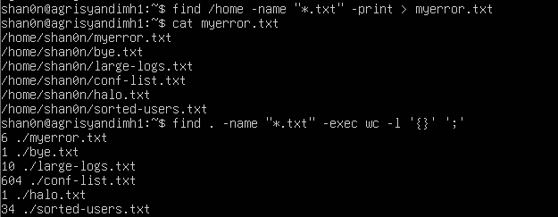

2. Perintah which
   - $ which ls

     

3. Perintah locate
   - $ locate "*.txt"

     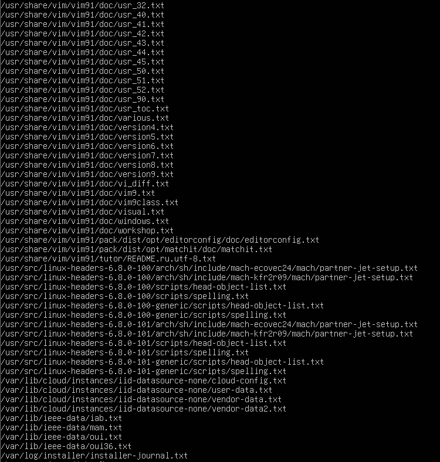

## Percobaan 6 Mencari text pada file
- $ grep Hallo *.txt

  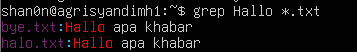

   
## Latihan
1. Cobalah urutan perintah berikut :
   - $ cd
   - $ pwd
   - $ ls -al
   - $ cd .
   - $ pwd
   - $ cd ..
   - $ pwd
   - $ ls -al
   - $ cd ..
   - $ pwd
   - $ ls -al
   - $ cd /etc
   - $ ls -al | more
   - $ cat passwd
   - $ cd -
   - $ pwd

     - 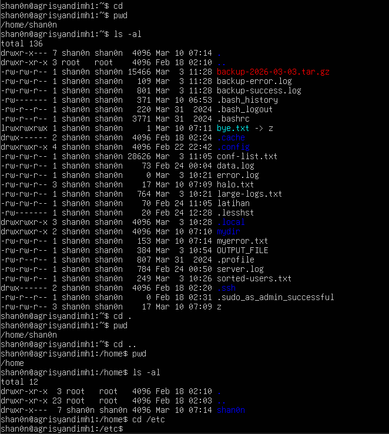
     - 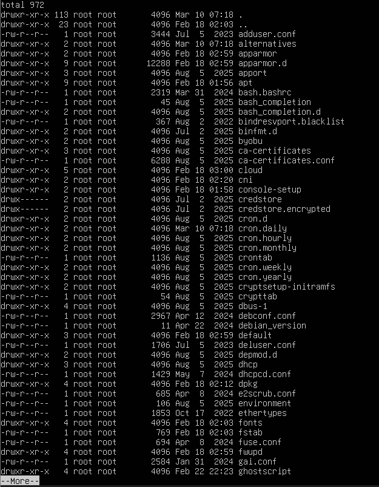
     - 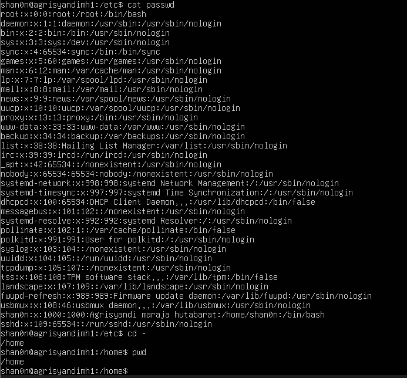

2. Lanjutkan penelusuran pohon pada sistem file menggunakan cd, ls, pwd dan cat. Telusuri direktori /bin, /usr/bin, /sbin, /tmp dan /boot.
    - 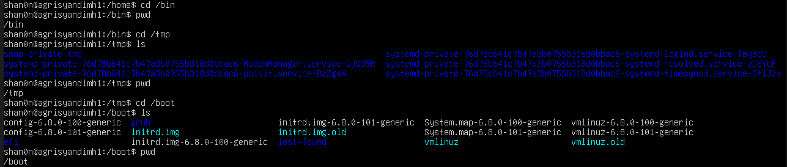

3. Telusuri direktori /dev. Identifikasi perangkat yang tersedia. Identifikasi tty (terminal) Anda (ketik who am i); siapa pemilih tty Anda (gunakan ls -l).
    - 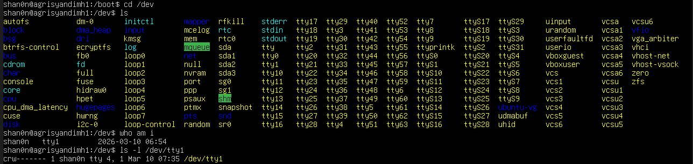

4. Telusuri directory /proc. Tampilkan isi file interrupts, devices, cpuinfo, meminfo dan uptime menggunakan perintah cat. Dapatkah Anda melihat mengapa directory /proc disebut pseudo-filesystem yang memungkinkan akses ke struktur data kernel ?
    - 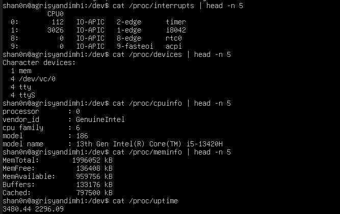

5. Ubahlah direktori home ke user lain secara langsung menggunakan cd ~username.
6. Ubah kembali ke direktori home Anda.
    -  (5-6)

7. Buat subdirektori work dan play.
8. Hapus subdirektori work.
   
    -  (7-8)
   
9. Copy file /etc/passwd ke direktori home Anda.
    
    - 
   
10. Pindahkan ke subdirectory play.  
    - 
   
11. Ubahlah ke subdirektori play dan buat symbolic link dengan nama terminal yang menunjuk ke perangkat tty. Apa yang terjadi jika melakukan hard link ke perangkat tty ?
    - 

12. Buatlah file bernama hello.txt yang berisi kata "hello word". Dapatkah Anda gunakan cp menggunakan "terminal" sebagai file asal untuk menghasilkan efek yang sama ?
13. Copy hello.txt ke terminal. Apa yang terjadi ?
    - 

14. Masih direktori home, copy keseluruhan direktori play ke direktori bernama work menggunakan symbolic link.
    - 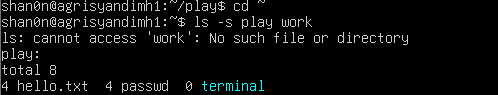
   
15. Hapus direktori work dan isinya dengan satu perintah.
    - 

## Kesimpulan
> Praktikum ini menunjukkan penggunaan perintah dasar Linux seperti cd, ls, pwd, dan cat untuk menavigasi struktur direktori yang bersifat hirarkis/bertingkat,
> di mana setiap direktori memiliki fungsi tertentu seperti /bin untuk program eksekusi dan /etc untuk konfigurasi sistem. Selain itu dipahami bahwa tidak semua 
> file tersimpan secara fisik di penyimpanan, karena direktori /proc merupakan pseudo-filesystem yang menampilkan informasi sistem secara real-time dari kernel,
> seperti data CPU dan memori. Praktikum ini juga melibatkan pengelolaan file dan direktori menggunakan perintah mkdir, rmdir, cp, dan mv, serta mempelajari konsep
> symbolic link sebagai penunjuk ke file atau perangkat lain dengan beberapa keterbatasan pada hard link. Melalui percobaan menyalin file ke perangkat terminal,
> dapat dipahami filosofi Linux bahwa “everything is a file”, di mana perangkat keras juga direpresentasikan sebagai file dalam direktori /dev. Intinya, dalam Linux,
> semua akan dikelola sebagai sebuah file, apapun itu.
