# Jobsheet 6
## Latihan 6.1
Jalankan ps aux dan amati outputnya 
1. Berapa total proses yang berjalan? Proses apa yang memiliki PID terkecil?

   

   Ada 128 proses

   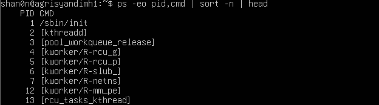

   Terdapat beberapa proses dengan PID terkecil

2. Jalankan pstree -p dan temukan proses bash Anda. Proses apa yang menjadi induk (PPID) dari bash tersebut?
   
   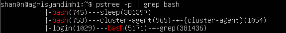

   Induknya adalah login(1029)

3. Bandingkan output ps aux dan ps aux -L. Apa perbedaan yang anda lihat?
   pada ps aux, yang ditampilkan hanyalah proses, sementara pada ps aux -L, yang ditampilkan proses dan juga thread.

## Latihan 6.2
1. Jalankan sleep 120 & dan amati kolom STAT pada ps aux. Kondisi apa yang ditampilkan?
   Mengapa proses sleep berada di kondisi tersebut?

   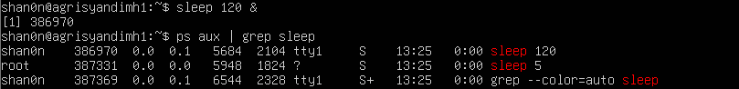

   proses sleep berada dalam status S (sleeping) karena proses hanya perlu menunggu waktunya (idle/ing),
   yang dimana status ini juga dapat di interupsi.

2. Jalankan beberapa perintah yang berhasil dan yang gagal, lalu catat exit code masing-masing. Pola apa yang Anda temukan
  
   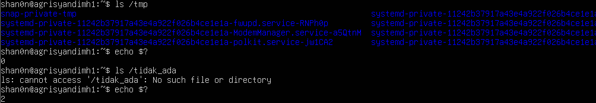

   ketika exit code = 0, maka berhasil run, sementara jika /= 0, maka proses gagal.

## Latihan 6.3
1. Jalankan nice -n 5 sleep 200 & dan verifikasi nilai NI-nya dengan ps.

   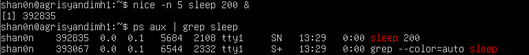

3. Ubah nilai nice menjadi 10 menggunakan renice, lalu verifikasi kembali.

   

3. Coba ubah nilai nice menjadi -5 tanpa sudo. Apa yang terjadi? Mengapa Linux membatasi hal ini untuk user biasa?

   

   Ditolak, dilakukan kemungkinan untuk mencegah monopoli CPU, untuk keadilan dalam sistem multiuser, atau untuk pengamanan dari serangan DoS

## Latihan 6.4
1. Jalankan sleep 400 &, kirim SIGSTOP, dan amati perubahan kolom STAT. Kondisi apa yang muncul?

   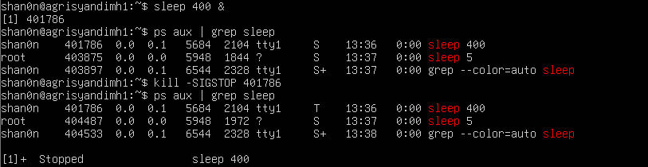

   kondisi s menjadi t (dihentikan)

3. Kirim SIGCONT dan verifikasi proses kembali berjalan.

   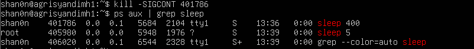

3. Hentikan proses dengan SIGTERM lalu verifikasi sudah tidak ada. Kapan Anda memilih SIGKILL daripada SIGTERM?

   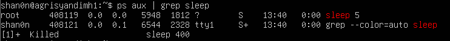

   - Sigterm biasanya digunkan ketika proses masih berjalan normal
   - Sigkill digunakan ketika suatu proses memiliki keadaan dimana dia haru dipaksa berhenti.

## Latihan 6.5
1. Jalankan top di foreground. Apa yang terjadi di terminal?

   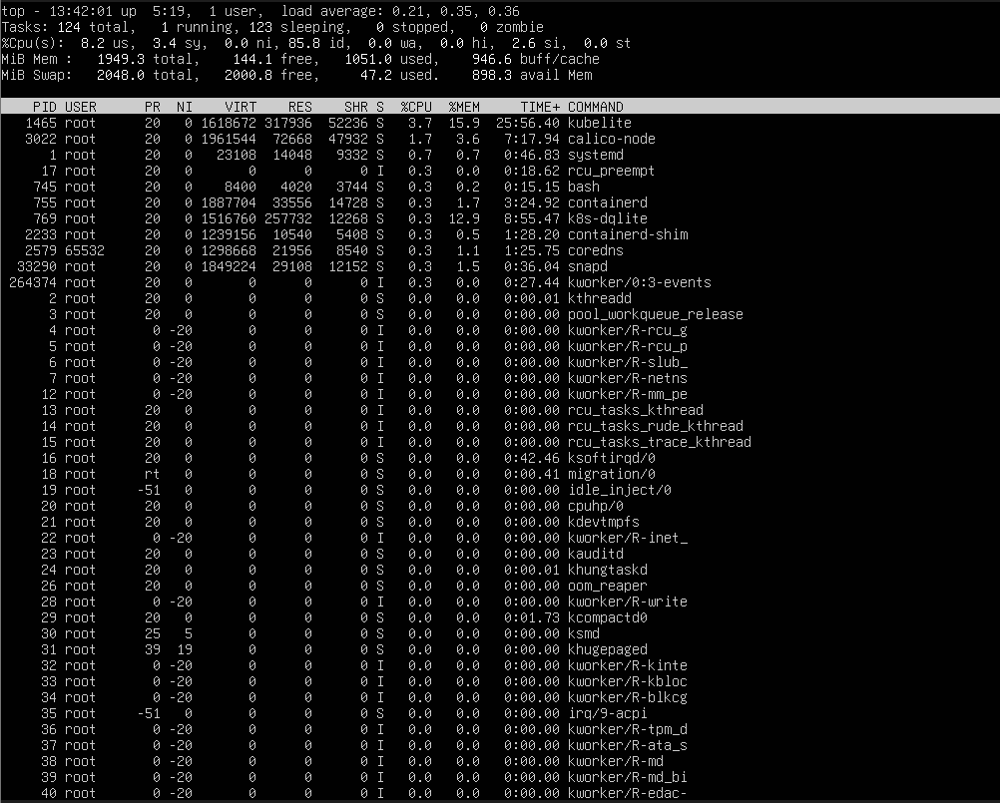

   terminal menampilkan proses yang ada

2. Tekan Ctrl+Z dan cek statusnya dengan jobs. Kondisi apa yang ditampilkan?

   

   kondisi stop

3. Pindahkan ke background dengan bg. Apakah top dapat berjalan denganbaik di background? Mengapa?

   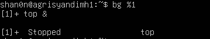

   top tidak optimal di background karena membutuhkan interaksi dari terminal.
   
4. Kembalikan ke foreground dengan fg, lalu keluar dengan q .
  
   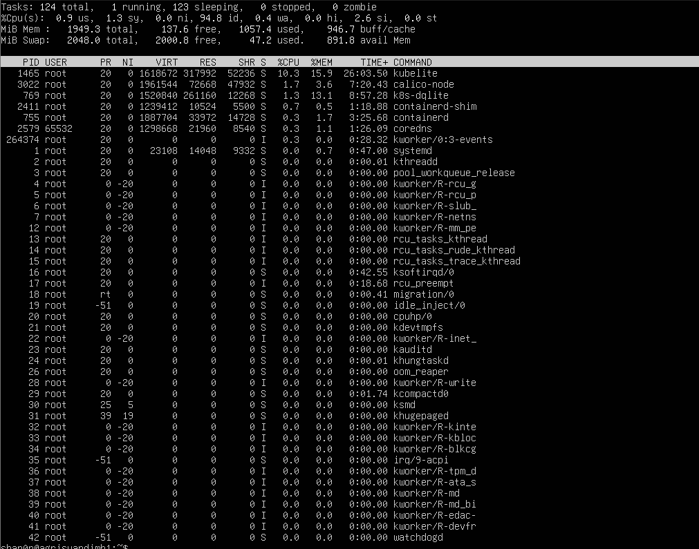

## Latihan 6.6
1. Gunakan ps aux –sort=%mem untuk menemukan proses yang menggunakan memori paling banyak di VM Anda. Proses apa itu?

   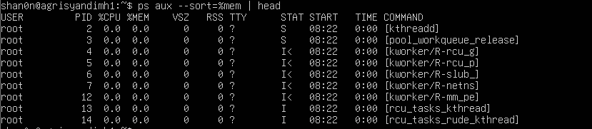

2. Di dalam top, tekan 1 . Apa yang berubah pada tampilan? Mengapa informasi ini berguna?

   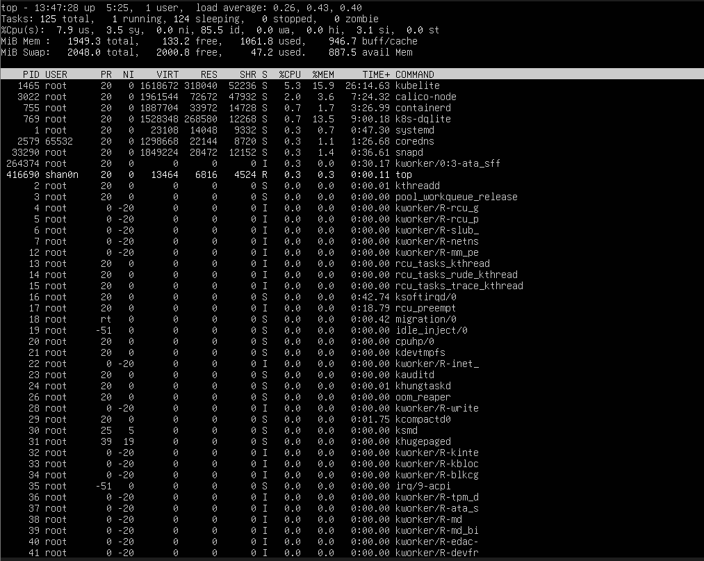

   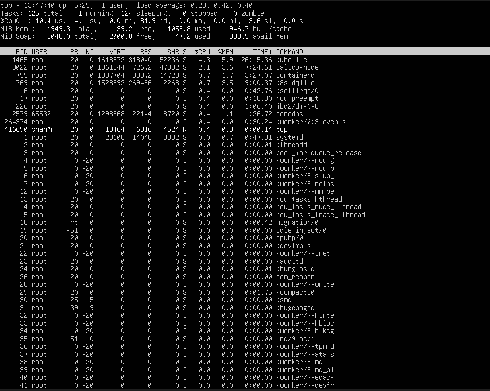

   menampilkan semua core CPU yang dapat digunakan untuk analisis beban per corenya.

3. Di dalam htop, navigasikan ke proses sshd menggunakan tombol panah. Tekan F9 dan amati opsi sinyal yang tersedia.

   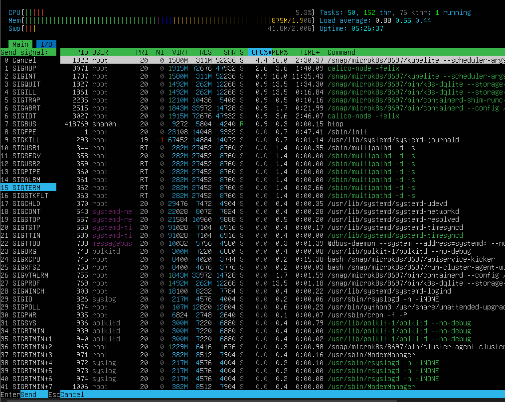

## Latihan 6.A
Eksplorasi Proses Sistem
1. Jalankan ps aux –forest dan temukan proses dengan PID 1. Apa nama dan fungsi proses tersebut dalam sistem Linux modern?

   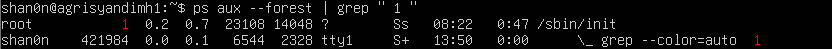

2. Hitung berapa proses yang dimiliki oleh user root dan berapa yang dimiliki oleh user Anda. Mengapa root memiliki lebih banyak proses?

   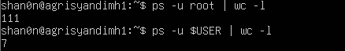

   Mengapa root lebih banyak? Karena menjalankan system service yang dimana memiliki preannya masing-masing.

3. Temukan semua proses yang berada dalam kondisi S. Mengapa sebagian besar proses di sistem berada dalam kondisi ini?

   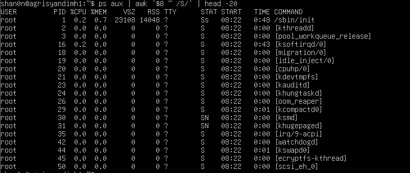

   Karena sebagian besar proses yang ada sedang menunggu saat mereka akan digunakan (idle/ing)

## Latihan 6.B
Simulasi Manajemen Job
1. Jalankan tiga perintah sleep dengan durasi 100, 200, dan 300 detik di background. Verifikasi ketiganya dengan jobs.

   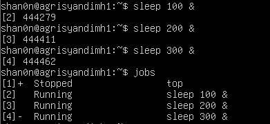

2. Bawa job kedua ke foreground, jeda dengan Ctrl+Z , lalu kembalikan ke background dengan bg.

   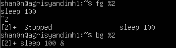

3. Hentikan job pertama dengan kill %1. Tampilkan kembali daftar job. Berapa job yang tersisa?

   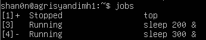

## Latihan 6.C
Prioritas dan Sinyal
1. Jalankan dua proses sleep: satu dengan nice +5 dan satu dengan nice +15. Verifikasi nilai NI keduanya dengan ps.

   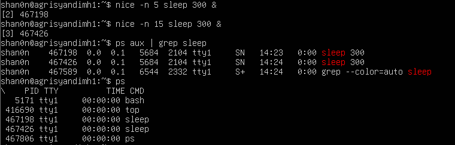

2. Gunakan renice untuk mengubah nice proses pertama menjadi +10. Proses mana yang kini lebih diprioritaskan scheduler?

   

3. Kirim SIGSTOP ke salah satu proses, verifikasi kondisi T-nya, lalu kirim SIGCONT. Akhiri semua proses percobaan dengan pkill sleep.

   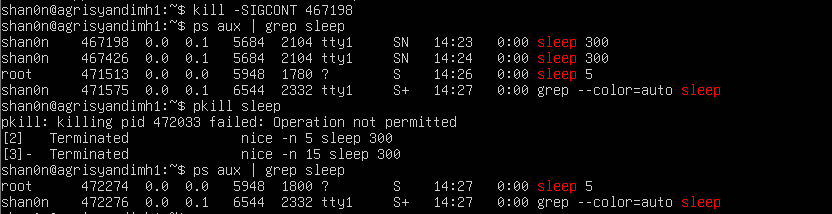
